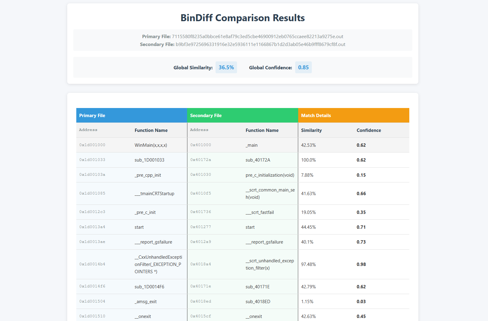

# BinDiff Online

A web application for comparing binary executable files using BinDiff.

## Features

- Upload two executable files for comparison
- View function-level matching between the two files
- Display similarity scores and confidence levels for each match

## Prerequisites

- Python 3.7 or higher
- IDA (must be installed separately)
- BinDiff (must be installed separately)

## Installation

1. Clone the repository:
```
git clone XXX
```

2. Set up a virtual environment (optional but recommended):
```
python -m venv venv
source venv/bin/activate  # On Windows: venv\Scripts\activate
```

3. Install the required dependencies:
```
pip install -r requirements.txt
```

4. Install BinDiff if not already installed (follow instructions from the official BinDiff documentation)

## Usage

1. Start the Flask application:
```
python app.py
```

2. Open your web browser and navigate to `http://127.0.0.1:5000`

3. Upload two executable files for comparison

4. View the comparison results showing function matches, similarity scores, and confidence levels

## Supported File Types

- .exe (Windows executable)
- .dll (Windows dynamic link library)
- .so (Linux shared object)
- .bin (Binary file)
- .elf (Executable and Linkable Format)
- .out (Unix executable)

## Sample



## Notes on the BinDiff Integration

This application provides a web interface for BinDiff functionality. You'll need to:

1. Ensure BinDiff is properly installed on your system

## License

[MIT License](LICENSE)

## Disclaimer

This tool is intended for legitimate software analysis purposes. Always ensure you have the right to analyze any executable files you upload. 